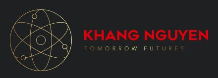

# Training. 

This repository is to teach students about technologies such as coding using different programming languages, version control using Github, and programming algorithms. The development and maintenance is sponsored by [Khang Nguyen](https://khangnguyen.netlify.app/).

You can see the contribution of each students.

## Contact Information

For more information contact ngkhang.v@gmail.com

### Connect

To know more Khang, you can visit my website or connect with me on LinkedIn

My portfolio: https://khangnguyen.netlify.app/
My Linkedin: https://www.linkedin.com/in/khang-nguyen-5883411a5/

    

